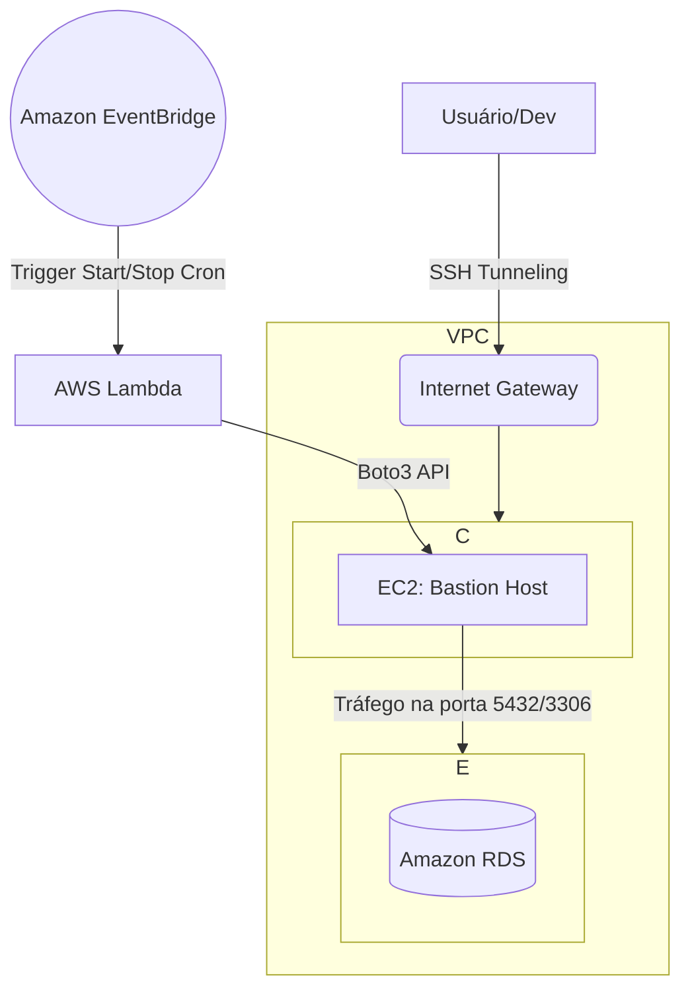

# Bastion Host Seguro e Automação RDS na AWS 🛡️


Este repositório contém os principais arquivos e a documentação para configurar uma arquitetura segura na AWS. O projeto foca em permitir o acesso a um banco de dados (RDS) privado através de um **Bastion Host (EC2)**, além de utilizar **AWS Lambda** e **EventBridge** para ligar e desligar a instância Bastion automaticamente.

## 🎯 Contexto de Negócio (Por que este projeto existe?)
Em ambientes corporativos, **nunca** expomos bancos de dados diretamente à internet por questões de segurança. O uso de um *Bastion Host* (servidor de salto) é a prática padrão de mercado. No entanto, deixar uma instância EC2 ligada 24/7 apenas para acessos esporádicos gera custos desnecessários. 
A automação com Lambda e EventBridge resolve esse problema, garantindo que o servidor só fique ligado durante o horário comercial (ou sob demanda), **reduzindo os custos do EC2 em até 70%**.

## 🏗️ Arquitetura do Projeto



### Componentes da Arquitetura:

1. **VPC Privada:** O Banco de Dados RDS fica isolado numa Subnet Privada, sem IP Público.
2. **Bastion Host:** Uma máquina EC2 rodando Amazon Linux/Ubuntu numa Subnet Pública.
3. **AWS Lambda:** Função em Python (Boto3) que recebe ordens para ligar/desligar o Bastion Host.
4. **Amazon EventBridge:** Serviço de agendamento (Cron) que dispara a Lambda em horários específicos.

---

## 📂 Arquivos Deste Repositório

- `src/lambda_function.py`: O código-fonte em Python 3.x para a AWS Lambda. Ele usa a biblioteca `boto3` para executar as ações de Start e Stop no EC2.
- `policies/lambda_policy.json`: A política de permissões (IAM Policy) mínima necessária para que a Lambda tenha autorização de gerenciar instâncias EC2 e salvar os logs no CloudWatch.

---

## 🚀 Passo a Passo (Configuração via Console da AWS)

Caso você não utilize o Terraform, você pode subir a infraestrutura inteira no Console da AWS seguindo estes passos:

### 1. Criar o Banco de Dados RDS (Subnet Privada)
- Crie um banco RDS (MySQL/PostgreSQL) e coloque-o numa Subnet **Privada** (Public Access = No).
- O Security Group do RDS não deve aceitar regras genéricas (ex: `0.0.0.0/0`).
- No Security Group do RDS, crie uma **Inbound Rule** para a porta do banco de dados (ex: 3306/5432) com a origem sendo o **ID do Security Group que será usado no Bastion Host**.

### 2. Criar a Instância EC2 Bastion (Subnet Pública)
- Crie uma EC2 numa Subnet **Pública**.
- Atribua um Elastic IP ou ative o Auto-assign Public IP.
- Security Group do Bastion: Libere a porta `22` (SSH) **somente para o seu IP residencial/corporativo**. (Evite `0.0.0.0/0`).

### 3. Configurar a Role e a AWS Lambda
- Vá até o serviço IAM e crie uma "Policy" utilizando o conteúdo do arquivo `policies/lambda_policy.json`.
- Crie uma IAM "Role" para uso da Lambda, e anexe a Policy criada acima.
- Acesse o serviço **AWS Lambda**, crie uma função escolhendo **Python 3.x** e assinale a Role que acabou de criar.
- Cole o código do arquivo `src/lambda_function.py` na Lambda e clique em **Deploy**.

### 4. Configurar as Regras no EventBridge
No Amazon EventBridge, crie duas **Schedules** (Regras agendadas):
1. **Regra para Ligar (Start):**
   - Agende para o horário desejado (ex: Cron `0 8 * * ? *` para rodar às 08:00 UTC).
   - Como Target (Alvo), selecione a sua Lambda.
   - Em *Additional Settings* -> *Configure Target Input*, selecione **Constant (JSON text)** e cole:
     ```json
     {
       "action": "start",
       "instance_id": "i-0abc123def456ghi"
     }
     ```
2. **Regra para Desligar (Stop):**
   - Agende para o horário desejado (ex: Cron `0 18 * * ? *` para rodar às 18:00 UTC).
   - Target = Sua Lambda.
   - Target Input (JSON text):
     ```json
     {
       "action": "stop",
       "instance_id": "i-0abc123def456ghi"
     }
     ```
*(Nota: Troque `i-0abc123def456ghi` pelo ID real da sua instância EC2 Bastion).*

---

## 💻 Como Acessar o RDS (SSH Tunneling)

Ao invés de instalar um cliente SQL no Bastion e rodar comandos no terminal, usamos um **Túnel SSH**. Isso redireciona uma porta da sua máquina local para o RDS passando pelo Bastion, permitindo usar o DBeaver, PGAdmin, Workbench, etc.

No seu terminal, rode o comando:
```bash
ssh -i "sua-chave.pem" -L PORTA_LOCAL:ENDPOINT_RDS:PORTA_BANCO ec2-user@IP_DO_BASTION -N
```

**Exemplo Prático (PostgreSQL):**
```bash
ssh -i "minha-chave.pem" -L 5432:meu-rds.aws.com:5432 ec2-user@54.21.32.11 -N
```

O terminal vai ficar "preso" e sem output (por causa do `-N`). Está tudo certo!
Agora, abra o seu gerenciador de banco de dados e conecte usando:
- **Host:** `localhost`
- **Port:** `5432` (A porta que você colocou como local no comando acima)
- **User/Password:** As credenciais do RDS.

Todo o tráfego passará com segurança da sua máquina, de forma encriptada pelo Bastion, direto para o seu RDS!

---

## 📸 Evidências / Demonstração

> **Aviso para Recrutadores / Avaliadores**: Esta seção contém as capturas de tela que comprovam a execução real deste laboratório e sua eficácia.

### 1. Conexão Bem Sucedida via SSH Tunnel

*Imagem 1: Demonstração da conexão local batendo no RDS na nuvem via Bastion.*


### 2. Execução da Automação (Lambda Start/Stop)
*Imagem 2: Logs do CloudWatch provando que a função Lambda ligou a instância corretamente no horário agendado.*


Imagem 3: Logs do CloudWatch provando que a função Lambda desligou a instância corretamente no horário agendado.


---

## 🔗 Referências e Contatos

- **Projeto Original:** Inspirado no artigo prático do [Medium - Bastion Host na AWS e Automação com Lambda e EventBridge](https://medium.com/@alanborges195/projeto-pr%C3%A1tico-bastion-host-na-aws-acesso-seguro-ao-rds-automa%C3%A7%C3%A3o-com-lambda-e-eventbridge-51ccd42d7575).
- **Autor / Desenvolvedor:** [Allan Borges - Conecte-se comigo no LinkedIn!](https://www.linkedin.com/in/allan-fborges)
